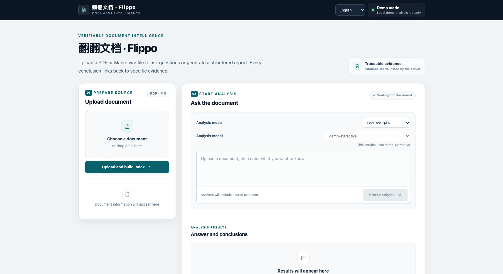

<p align="right"><a href="README.zh-CN.md">中文</a></p>

<p align="center">
  
</p>

<h1 align="center">翻翻文档 · Flippo</h1>

<p align="center">
  <strong>Effortless answers. Traceable sources.</strong>
</p>

<p align="center">Python 3.11+ · FastAPI · Google ADK · Proof of Concept</p>

Flippo is a verifiable RAG workspace for analyzing one document at a time. After you upload a PDF or Markdown file, it builds full-text and vector indexes for an immutable document version, uses a budget-constrained agent to retrieve the source text, and presents answers, structured reports, supporting evidence, and the complete execution trace in one interface.

> [!IMPORTANT]
> Flippo can verify which saved source passage a citation came from. It cannot automatically prove that the model's reasoning or conclusions are correct. Important conclusions should still be checked against the source by a human reviewer.

## Features

| Capability | Current implementation |
| --- | --- |
| Document ingestion | PDF and UTF-8 Markdown; preserves page numbers, heading paths, and source offsets; scanned PDFs return `needs_ocr` |
| Bilingual interface | Chinese by default, with instant English switching and a saved language preference |
| Hybrid retrieval | SQLite FTS5 + vector retrieval + RRF fusion; Chinese titles and body text include bigram search features, with mixed Chinese-English queries supported |
| Verifiable evidence | Only evidence registered through `read_passage` during the current run may be cited; the server reconstructs quotations from saved source text |
| Agent | Offline extractive Demo Agent; the production path uses Google ADK with Gemini or an Unsloth OpenAI-compatible service |
| Model selection | Shows Unsloth chat models whose status is currently `loaded: true`; revalidates before every run and refuses inference when an explicit selection is no longer valid |
| Output | Focused answers, structured reports, recommendations, open questions, and citation locations |
| Observability | SQLite + content-level JSONL traces recording retrieval, tools, model events, budgets, stop reasons, and citation validation |

<p align="center">
  
</p>

For the design background, see [`rag-document-agent-poc-design.md`](./rag-document-agent-poc-design.md).

## Quick start: offline Demo

Demo mode requires no model credentials and is intended for trying the ingestion, indexing, retrieval, citation, and interface workflow. It uses deterministic embeddings and an extractive Agent. **Deterministic embeddings are for demos and tests only; they are not a semantic model and do not represent production retrieval quality.**

```bash
python3 -m venv .venv
source .venv/bin/activate
python -m pip install -e '.[dev]'

# 仅在 .env 不存在时复制，避免覆盖已有配置
test -f .env || cp .env.example .env

uvicorn rag_agent.api:app --reload
```

Open <http://127.0.0.1:8000>. The OpenAPI documentation is available at <http://127.0.0.1:8000/docs>.

The key Demo settings are:

```dotenv
RAG_AGENT_PROVIDER=demo
RAG_EMBEDDING_PROVIDER=deterministic
```

`pyproject.toml` and `requirements.lock` pin the project's direct dependencies. `requirements.lock` is not a cross-platform lockfile containing every transitive dependency and hash; production deployments should generate a complete, reproducible lockfile on the target platform.

## Workflow

1. Upload one PDF or Markdown document.
2. Wait for the document status to become `ready`; scanned documents must be processed by an external OCR tool first.
3. Choose question-answering or report mode. Unsloth users may select “Auto” or a currently loaded model.
4. Enter a question and start the analysis.
5. Review citation locations under the result, expand the complete evidence, and inspect the JSON trace when needed.

Each session is bound to a specific `document_id + version_id`; a run never retrieves content from another document version.

## Configuring real models

The Agent and embeddings are configured independently. You can use a Gemini Agent with Gemini embeddings, or a local Unsloth Agent with a separate Gemini or OpenAI-compatible embedding service.

### Gemini Agent

```dotenv
RAG_AGENT_PROVIDER=gemini
RAG_MODEL=gemini-2.5-flash
GOOGLE_API_KEY=...
```

When `RAG_EMBEDDING_PROVIDER=deterministic`, upload, indexing, and retrieval remain available even if Agent credentials are missing. Agent runs fail explicitly and never switch silently to Demo. If Gemini or OpenAI-compatible embeddings are selected, the corresponding embedding credentials must be present when the service starts.

### Unsloth Agent

Start Unsloth Studio or the service in OpenAI-compatible API mode. When launching it from the command line, disabling the server-side tool layer is recommended so that ADK can manage function tools:

```bash
unsloth run \
  --model unsloth/your-model-GGUF \
  --gguf-variant YOUR_QUANT \
  --api-only --disable-tools \
  -p 8888 -q
```

Configure Flippo:

```dotenv
RAG_AGENT_PROVIDER=unsloth
UNSLOTH_BASE_URL=http://127.0.0.1:8888/v1
UNSLOTH_API_KEY=...

# 可选：多个聊天模型同时 loaded 时，作为“自动”模式的优先项
UNSLOTH_MODEL_ID=
```

Unsloth's `/v1/models` response may contain both downloaded and loaded models. Flippo accepts only chat-capable entries with `loaded: true` and does not rely on response order. It discovers and validates the actual model again before every run, so changing the loaded model in Unsloth Studio normally requires neither an `.env` update nor a Flippo restart.

You do not need to enable **Switch model by request** in Unsloth Studio. Flippo performs read-only discovery and never loads, unloads, or switches a model through a request. If multiple models are loaded, you can select one explicitly in the interface. If an explicit selection has become invalid before a run, the run fails before calling the model.

Read-only inspection example:

```bash
curl http://127.0.0.1:8888/v1/models \
  -H "Authorization: Bearer $UNSLOTH_API_KEY"
```

### Separate embedding service

Gemini embeddings:

```dotenv
RAG_EMBEDDING_PROVIDER=gemini
RAG_EMBEDDING_MODEL=text-embedding-004
GOOGLE_API_KEY=...
```

OpenAI-compatible embeddings:

```dotenv
RAG_EMBEDDING_PROVIDER=openai
RAG_OPENAI_EMBEDDING_BASE_URL=http://127.0.0.1:9000/v1
RAG_OPENAI_EMBEDDING_API_KEY=...
RAG_EMBEDDING_MODEL=your-embedding-model
```

## API

| Method | Path | Description |
| --- | --- | --- |
| `GET` | `/health` | Service, Agent, and embedding configuration status |
| `GET` | `/models` | Model information for the current provider; Unsloth returns loaded models and the automatic selection result, while Demo/Gemini return the configured model; server-side credentials are never returned |
| `POST` | `/documents` | Upload a PDF/Markdown document and return its version and processing status |
| `GET` | `/documents/{document_id}/versions/{version_id}` | Poll parsing, embedding, and indexing status |
| `POST` | `/sessions` | Create a session for a ready document version |
| `POST` | `/sessions/{session_id}/messages` | Create a question-answering or report run |
| `GET` | `/runs/{run_id}` | Read run status and the final result |
| `GET` | `/runs/{run_id}/trace` | JSON trace; add `?format=jsonl` for JSONL |
| `GET` | `/evidence/{evidence_id}` | Read registered evidence and its complete location |

The minimal flow is shown below. `POST /documents` only accepts the upload and schedules processing asynchronously. After obtaining `document_id` and `version_id` from its response, poll `GET /documents/{document_id}/versions/{version_id}` until `status` becomes `ready`, then create a session.

```bash
curl -F 'file=@examples/sample.md;type=text/markdown' \
  http://127.0.0.1:8000/documents

# 使用上传响应中的 document_id 和 version_id 轮询
curl http://127.0.0.1:8000/documents/doc_.../versions/docv_...

# 仅在上述响应的 status 为 ready 后创建会话
curl -X POST http://127.0.0.1:8000/sessions \
  -H 'Content-Type: application/json' \
  -d '{"document_id":"doc_...","version_id":"docv_..."}'

curl -X POST http://127.0.0.1:8000/sessions/ses_.../messages \
  -H 'Content-Type: application/json' \
  -d '{"message":"审批记录需要保留多久？","request_type":"question","model_id":null}'
```

`request_type` accepts `question`, `report`, and `auto`. With Unsloth, `model_id: null` discovers and automatically resolves the currently loaded model again on every run; an explicit ID must still be loaded at run time. Demo and Gemini use the configured model returned by `/models` and do not perform dynamic loaded-state discovery. The report structure is defined in [`schemas/report.schema.json`](./schemas/report.schema.json).

## Citations and security boundaries

Search results are candidates and cannot be cited directly. A valid citation must meet all of these conditions:

1. The evidence was registered by `read_passage` under the current `run_id`.
2. The evidence belongs to the immutable document version bound to the session.
3. The corresponding chunk still exists in that version.
4. The server reconstructs the quotation and location from saved evidence instead of trusting model output.

These checks validate source ownership, version boundaries, and quotation consistency. They do not determine whether the model understood the source correctly, and they do not guarantee that a conclusion is complete, unbiased, or suitable for a high-risk decision.

Instructions inside documents are treated as untrusted content. The Agent can use only three read-only tools: `search_document`, `read_passage`, and `inspect_document_outline`. Tracing attempts to redact known credential fields and common key formats, but traces should still be handled as sensitive data.

## Evaluation and tests

[`examples/eval.jsonl`](./examples/eval.jsonl) demonstrates the evaluation format only; it is not a benchmark. The evaluation schema is at [`schemas/eval-case.schema.json`](./schemas/eval-case.schema.json).

Import the target document first, then run:

```bash
rag-eval examples/eval.jsonl \
  --document-id doc_... \
  --version-id docv_... \
  --output eval-result.json
```

The output includes answer-term coverage, labeled-evidence recall, refusal accuracy, valid citation-location rate, query-rewrite observations, and trace completeness. Factual support and answer quality still require human review.

Run the automated tests:

```bash
python -m pytest
```

The test suite covers ingestion and retry, PDF/Markdown structure, Chinese full-text search, hybrid retrieval, budget enforcement, citation validation, refusal behavior, structured reports, trace redaction, model discovery, and per-run model reselection.

## Project structure

```text
rag_agent/
  api.py                 FastAPI, Web UI, and public API
  agent.py               Demo/Google ADK execution, tools, and budgets
  models.py              Unsloth loaded-model discovery and runtime selection
  ingestion.py           Upload validation, parsing, chunking, and indexing task claims
  retrieval.py           FTS5/vector retrieval, RRF, and evidence registration
  lexical.py             Chinese/English terms and Chinese bigram full-text features
  embeddings.py          Deterministic, Gemini, and OpenAI embeddings
  validation.py          Server-side citation validation and reconstruction
  trace.py               SQLite/JSONL traces and redaction
  eval_harness.py        JSONL evaluation tool
  static/                Chinese and English web interface
examples/                Example documents and evaluation format
schemas/                 Report and evaluation JSON Schemas
tests/                   Offline automated tests
```

## Data, privacy, and deployment limitations

- The default data directory is `./data`; it contains uploaded source files, the SQLite database, and per-run JSONL traces.
- Traces may include user questions, retrieved source text, model input and output, tool arguments, and errors. Do not commit `data/` or traces to Git, and do not treat them as already anonymized.
- When Gemini or a remote OpenAI-compatible service is used, the relevant prompts and retrieved evidence are sent to the configured provider. Deployers must evaluate the provider's data-processing terms.
- This POC has no user authentication, authorization, tenant isolation, data-retention policy, or audit access control. Bind it only to a trusted network and avoid exposing it publicly.
- Document processing uses FastAPI `BackgroundTasks`. A conditional update in a SQLite transaction claims each `uploaded` task and prevents duplicate processing of one version; this is not a durable task queue, and automatic recovery after a process crash, distributed scheduling, and object storage are not implemented.
- The design target is a local, single-instance deployment. Production deployments should add authentication, a durable queue, recovery policies, backups, retention cleanup, and provider-side integration tests.
- OCR, complex table reconstruction, PDF-coordinate highlighting, and multi-document knowledge bases are not currently provided.

### Index upgrade notes

When a database is first upgraded to Chinese bigram full-text features, a schema marker causes the FTS table to be rebuilt once and idempotently. Saved source text, chunks, and vectors are unchanged. Historical documents already in `ready` state are not automatically reparsed or rechunked, so new chunking rules apply only to newly indexed document versions. To apply the new chunking strategy to old data, create a new index and reimport the source files according to the deployment's data-migration process.

If the process exits during a background task, a version may remain in `parsing` or `indexing`. There is currently no durable queue to take over such a task automatically; operations must detect it and rebuild the version according to the data-recovery procedure.

## Contributing

Before submitting a change:

1. Keep the API, schemas, README files, and Chinese/English interface copy consistent.
2. Add regression coverage for changes that affect citation boundaries, index consistency, model selection, or concurrent task claiming.
3. Run `python -m pytest`.
4. Do not commit `.env`, API keys, uploaded documents, databases, traces, or sensitive evaluation results.

## License

No `LICENSE` file is currently provided.
