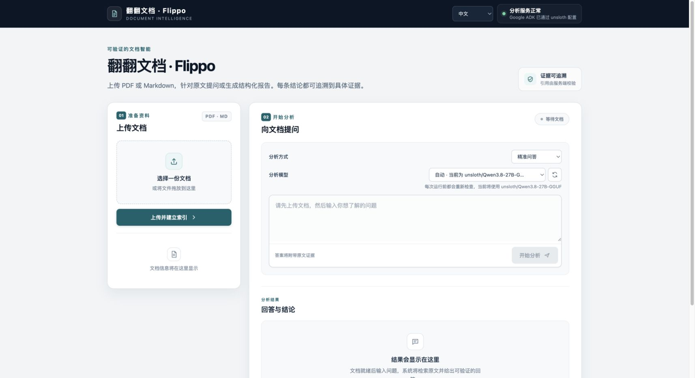

<p align="right"><a href="README.md">English</a></p>

<p align="center">
  
</p>

<h1 align="center">翻翻文档 · Flippo</h1>

<p align="center">
  <strong>轻松有出处。</strong><br>
  <em>Effortless answers. Traceable sources.</em>
</p>

<p align="center">Python 3.11+ · FastAPI · Google ADK · Proof of Concept</p>

Flippo 是一个面向单份文档的可验证 RAG 工作台。上传 PDF 或 Markdown 后，它会按不可变文档版本建立全文与向量索引，通过受预算约束的 Agent 检索原文，并把回答、结构化报告、引用证据和完整运行轨迹放在同一个界面中。

> [!IMPORTANT]
> Flippo 能验证“引用来自哪段已保存原文”，不能自动证明模型的推理或结论正确。重要结论仍应由人复核原文。

## 功能概览

| 能力 | 当前实现 |
| --- | --- |
| 文档导入 | PDF、UTF-8 Markdown；保留页码、标题路径与原文偏移；扫描型 PDF 会返回 `needs_ocr` |
| 双语界面 | 中文默认，支持即时切换英文并保存偏好 |
| 混合检索 | SQLite FTS5 + 向量检索 + RRF 融合；中文标题和正文加入双字检索特征，中英混合查询可用 |
| 可核验证据 | 只有当前运行通过 `read_passage` 注册的 evidence 才能引用；服务端按保存的原文重建引文 |
| Agent | 离线 Demo 抽取式 Agent；真实路径使用 Google ADK，可连接 Gemini 或 Unsloth OpenAI 兼容服务 |
| 模型选择 | 展示 Unsloth 当前 `loaded: true` 的聊天模型；每次运行前重新确认，显式选择失效时拒绝推理 |
| 输出 | 精准问答、结构化报告、建议、待确认问题与引用位置 |
| 可观测性 | SQLite + JSONL 内容级 trace，记录检索、工具、模型事件、预算、停止原因与引用校验 |

<p align="center">
  
</p>

设计背景见 [`rag-document-agent-poc-design.md`](./rag-document-agent-poc-design.md)。

## 快速开始：离线 Demo

Demo 模式无需模型密钥，适合体验导入、索引、检索、引用和界面流程。它使用确定性 embedding 与抽取式 Agent；**确定性 embedding 只用于演示和测试，不是语义模型，也不代表生产检索质量。**

```bash
python3 -m venv .venv
source .venv/bin/activate
python -m pip install -e '.[dev]'

# 仅在 .env 不存在时复制，避免覆盖已有配置
test -f .env || cp .env.example .env

uvicorn rag_agent.api:app --reload
```

打开 <http://127.0.0.1:8000>。OpenAPI 文档位于 <http://127.0.0.1:8000/docs>。

Demo 的关键配置为：

```dotenv
RAG_AGENT_PROVIDER=demo
RAG_EMBEDDING_PROVIDER=deterministic
```

`pyproject.toml` 与 `requirements.lock` 固定了项目的直接依赖版本。`requirements.lock` 不是包含全部传递依赖和哈希的跨平台锁文件；正式部署应在目标平台生成完整、可复现的依赖锁。

## 使用流程

1. 上传一份 PDF 或 Markdown。
2. 等待文档状态变为 `ready`；扫描件需要先在外部完成 OCR。
3. 选择问答或报告模式。Unsloth 用户可选择“自动”或一个当前已加载的模型。
4. 输入问题并开始分析。
5. 在结果下查看引用位置、展开完整 evidence，并按需查看 JSON trace。

每个会话绑定一个明确的 `document_id + version_id`，运行不会跨文档版本检索。

## 配置真实模型

Agent 与 embedding 分开配置。可以使用 Gemini Agent + Gemini embedding，也可以使用本地 Unsloth Agent + 独立的 Gemini/OpenAI 兼容 embedding 服务。

### Gemini Agent

```dotenv
RAG_AGENT_PROVIDER=gemini
RAG_MODEL=gemini-2.5-flash
GOOGLE_API_KEY=...
```

当 `RAG_EMBEDDING_PROVIDER=deterministic` 时，即使缺少 Agent 凭据，上传、索引和检索仍可使用，Agent 运行会明确失败，不会静默切换到 Demo。若选择 Gemini 或 OpenAI 兼容 embedding，服务启动时必须提供对应的 embedding 凭据。

### Unsloth Agent

先以 OpenAI 兼容 API 模式启动 Unsloth Studio/服务。若由命令行启动，建议禁用服务端工具层，让 ADK 管理函数工具：

```bash
unsloth run \
  --model unsloth/your-model-GGUF \
  --gguf-variant YOUR_QUANT \
  --api-only --disable-tools \
  -p 8888 -q
```

配置 Flippo：

```dotenv
RAG_AGENT_PROVIDER=unsloth
UNSLOTH_BASE_URL=http://127.0.0.1:8888/v1
UNSLOTH_API_KEY=...

# 可选：多个聊天模型同时 loaded 时，作为“自动”模式的优先项
UNSLOTH_MODEL_ID=
```

Unsloth 的 `/v1/models` 可能同时列出已下载和已加载模型。Flippo 只接受 `loaded: true` 且可用于聊天的条目，不依赖响应顺序。每次运行都会重新查询并校验实际模型，因此在 Unsloth Studio 中更换已加载模型后通常无需修改 `.env` 或重启 Flippo。

无需开启 Unsloth Studio 的 **Switch model by request**。Flippo 只做只读发现，不会通过请求加载、卸载或切换模型。若多个模型同时已加载，可在界面明确选择；若显式选择在运行前已失效，运行会在调用模型前失败。

只读检查示例：

```bash
curl http://127.0.0.1:8888/v1/models \
  -H "Authorization: Bearer $UNSLOTH_API_KEY"
```

### 独立 embedding

Gemini embedding：

```dotenv
RAG_EMBEDDING_PROVIDER=gemini
RAG_EMBEDDING_MODEL=text-embedding-004
GOOGLE_API_KEY=...
```

OpenAI 兼容 embedding：

```dotenv
RAG_EMBEDDING_PROVIDER=openai
RAG_OPENAI_EMBEDDING_BASE_URL=http://127.0.0.1:9000/v1
RAG_OPENAI_EMBEDDING_API_KEY=...
RAG_EMBEDDING_MODEL=your-embedding-model
```

## API

| 方法 | 路径 | 说明 |
| --- | --- | --- |
| `GET` | `/health` | 服务、Agent 与 embedding 配置状态 |
| `GET` | `/models` | 当前 provider 的模型信息；Unsloth 返回已加载模型与自动选择结果，Demo/Gemini 返回当前配置模型；不返回服务端密钥 |
| `POST` | `/documents` | 上传 PDF/Markdown，返回版本和处理状态 |
| `GET` | `/documents/{document_id}/versions/{version_id}` | 轮询解析、embedding 与索引状态 |
| `POST` | `/sessions` | 为一个 ready 文档版本创建会话 |
| `POST` | `/sessions/{session_id}/messages` | 创建问答或报告运行 |
| `GET` | `/runs/{run_id}` | 查询运行状态和最终结果 |
| `GET` | `/runs/{run_id}/trace` | JSON trace；加 `?format=jsonl` 返回 JSONL |
| `GET` | `/evidence/{evidence_id}` | 读取已注册的完整 evidence 与位置 |

最小流程如下。`POST /documents` 只负责接收上传并异步安排处理；从响应中取得 `document_id` 和 `version_id` 后，轮询 `GET /documents/{document_id}/versions/{version_id}`，等待 `status` 变为 `ready`，再创建会话。

```bash
curl -F 'file=@examples/sample.md;type=text/markdown' \
  http://127.0.0.1:8000/documents

# 使用上传响应中的 document_id 和 version_id 轮询
curl http://127.0.0.1:8000/documents/doc_.../versions/docv_...

# 仅在上述响应的 status 为 ready 后创建会话
curl -X POST http://127.0.0.1:8000/sessions \
  -H 'Content-Type: application/json' \
  -d '{"document_id":"doc_...","version_id":"docv_..."}'

curl -X POST http://127.0.0.1:8000/sessions/ses_.../messages \
  -H 'Content-Type: application/json' \
  -d '{"message":"审批记录需要保留多久？","request_type":"question","model_id":null}'
```

`request_type` 支持 `question`、`report` 和 `auto`。使用 Unsloth 时，`model_id: null` 表示每次运行重新发现并自动解析当前已加载模型；显式 ID 必须在运行时仍处于已加载状态。Demo 与 Gemini 使用 `/models` 返回的当前配置模型，不执行动态 loaded 状态发现。报告结构见 [`schemas/report.schema.json`](./schemas/report.schema.json)。

## 引用与安全边界

搜索结果只是候选，不能直接成为引用。一次有效引用必须满足：

1. evidence 由 `read_passage` 在当前 `run_id` 下注册；
2. evidence 属于会话绑定的不可变文档版本；
3. 对应 chunk 仍存在于该版本；
4. 引文和位置由服务端根据保存的 evidence 重建，而不是信任模型输出。

这套检查验证的是来源归属、版本边界和引文一致性。它不判断模型是否正确理解原文，也不保证结论完整、无偏见或适合高风险决策。

文档内的指令按不可信内容处理，Agent 只能使用 `search_document`、`read_passage` 和 `inspect_document_outline` 三个只读工具。trace 会尝试脱敏已知凭据字段和常见密钥形态，但仍应按敏感数据管理。

## 评测与测试

[`examples/eval.jsonl`](./examples/eval.jsonl) 仅演示评测格式，不是 benchmark。评测 Schema 位于 [`schemas/eval-case.schema.json`](./schemas/eval-case.schema.json)。

先导入目标文档，再运行：

```bash
rag-eval examples/eval.jsonl \
  --document-id doc_... \
  --version-id docv_... \
  --output eval-result.json
```

输出包括答案术语覆盖、标注证据召回、拒答准确率、引用定位有效率、查询改写观察和 trace 完整性。事实支持度与答案质量仍需要人工评审。

运行自动测试：

```bash
python -m pytest
```

测试覆盖导入与重试、PDF/Markdown 结构、中文全文检索、混合检索、预算控制、引用校验、拒答、结构化报告、trace 脱敏、模型发现与每次运行重新选择。

## 项目结构

```text
rag_agent/
  api.py                 FastAPI、Web UI 和公开 API
  agent.py               Demo/Google ADK 执行、工具与预算
  models.py              Unsloth 已加载模型发现与运行时选择
  ingestion.py           上传校验、解析、分块与索引任务认领
  retrieval.py           FTS5/向量检索、RRF 与 evidence 注册
  lexical.py             中英文词项和中文双字全文特征
  embeddings.py          deterministic、Gemini、OpenAI embedding
  validation.py          服务端引用校验与重建
  trace.py               SQLite/JSONL trace 与脱敏
  eval_harness.py        JSONL 评测工具
  static/                中英文网页界面
examples/                示例文档与评测格式
schemas/                 报告与评测 JSON Schema
tests/                   离线自动测试
```

## 数据、隐私与部署限制

- 默认数据目录为 `./data`，包含上传原文件、SQLite 数据库和逐运行 JSONL trace。
- trace 可能包含用户问题、检索到的原文、模型输入输出、工具参数和错误信息。不要把 `data/` 或 trace 直接提交到 Git，也不要将其视为已经匿名化。
- 使用 Gemini 或远程 OpenAI 兼容服务时，相关提示和检索证据会发送给所配置的提供方；部署者需要自行评估数据处理条款。
- 当前 POC 没有用户认证、授权、租户隔离、数据保留策略或审计访问控制。建议仅绑定可信网络并避免公开暴露。
- 文档处理使用 FastAPI `BackgroundTasks`。SQLite 事务会以条件更新认领 `uploaded` 任务，避免同一版本被重复处理；但它不是持久任务队列，进程崩溃后的自动恢复、分布式调度和对象存储尚未实现。
- 设计目标是本地单实例。生产环境应增加认证、持久队列、恢复策略、备份、保留期清理和供应商侧集成测试。
- 当前不提供 OCR、复杂表格重建、PDF 坐标高亮或多文档知识库。

### 索引升级说明

数据库首次升级到中文双字全文特征时，会通过 schema marker 幂等重建一次 FTS 表；保存的原文、chunk 和向量不变。已处于 `ready` 的历史文档不会自动重新解析或重新分块，因此新分块规则只适用于新建索引的文档版本。如需让旧数据采用新分块策略，应按部署的数据迁移流程创建新索引并重新导入原文件。

如果进程在后台任务中途退出，版本可能停留在 `parsing` 或 `indexing`。当前没有持久队列自动接管这类任务，需要运维侧检测并按数据恢复流程重新建立版本。

## 贡献

提交改动前请：

1. 保持 API、Schema、README 和中英文界面文案一致；
2. 为影响引用边界、索引一致性、模型选择或并发认领的行为补充回归测试；
3. 运行 `python -m pytest`；
4. 不提交 `.env`、API key、上传文档、数据库、trace 或评测结果中的敏感内容。

## 许可证

当前尚未提供 `LICENSE` 文件。
