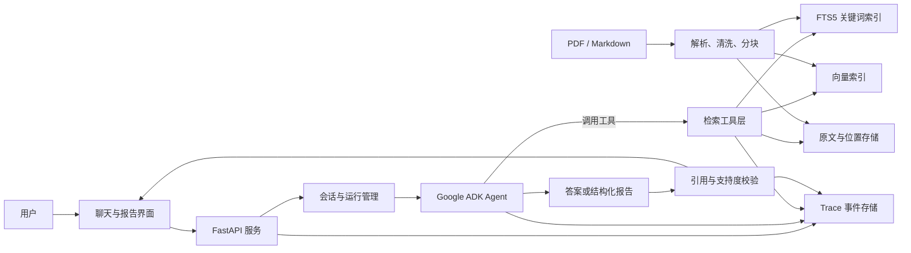
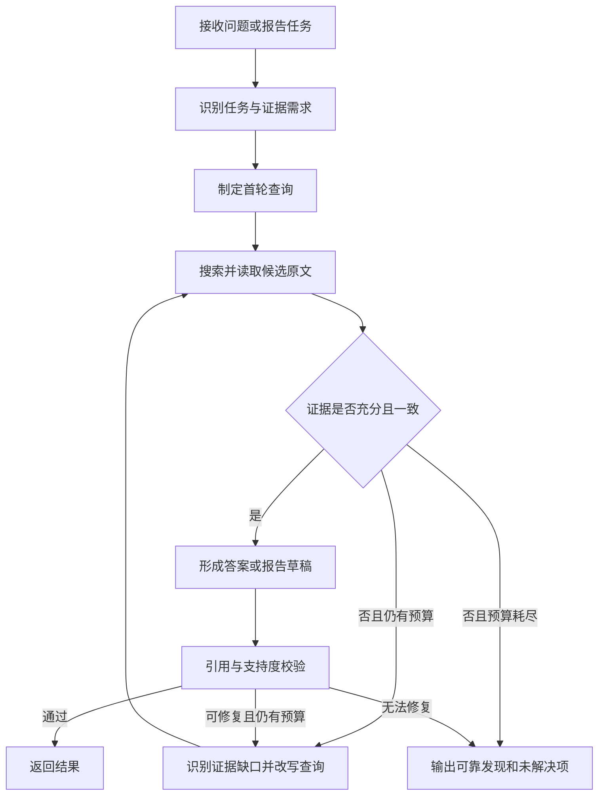

# 单文档 RAG Agent POC 详细设计

## 1. 文档目的

本文给出“AI Agent Evaluation Developer for RAG Document Workflow POC”的详细设计。系统接收一份大型 PDF 或 Markdown 文档，围绕该文档提供可连续使用的问答与报告生成能力。Agent 可以多次检索文档，并在现有证据不足时改写查询、扩大或缩小检索范围，最终给出带有可核验引用的答案或结构化简报，同时保存完整的运行轨迹。

本文是实现方案，不表示相关功能已经完成。

## 2. 目标、边界与设计原则

### 2.1 POC 目标

系统应完成以下核心能力：

1. 导入一份大型 PDF 或 Markdown 文档，并建立可复用索引。
2. 回答以该文档为事实来源的问题。
3. 支持同一会话中的连续提问，并理解必要的上下文指代。
4. 当检索证据不足、冲突或覆盖不完整时，主动改写查询并继续检索。
5. 生成结构化报告或简报，使关键事实均关联到文档证据。
6. 为引用提供可核验的位置、原文摘录和稳定的证据标识。
7. 保存完整 Agent trace，以便调试、评测、成本分析和复现。

### 2.2 POC 范围

本阶段包含：

- 单次工作空间只启用一个文档版本；
- 文本型 PDF 与 Markdown；
- 文档解析、分块、关键词索引、向量索引及混合检索；
- 基于 Google ADK 的有界 Agent 工具调用循环；
- 问答、结构化报告、引用展示和 trace 查看；
- 本地或单实例部署；
- 使用真实样本文档建立小规模评测集。

本阶段不包含：

- 多租户、复杂用户权限及组织级审计；
- 跨文档检索和大规模分布式向量数据库；
- 复杂版面重建、图片语义理解和通用 OCR 流水线；
- 自动修改原文档；
- 生产级高可用、灾备和大规模并发能力。

扫描型 PDF 可在导入时识别，并返回“需要 OCR”的明确状态。若委托方需要扫描件支持，可将 OCR 作为扩展项加入实现。

### 2.3 假设

- 输入文档不包含恶意文件结构，且调用方具有处理该文档的权利。
- PDF 主要包含可提取文本；表格准确度取决于文档版面和解析器能力。
- 模型服务、Embedding 服务和 API 凭据由部署环境配置。
- POC 的答案只以当前文档版本为事实依据，不主动使用互联网知识补齐文档缺口。
- 引用的最终权威内容是保存的原始文本片段，而非模型生成的片段摘要。

### 2.4 设计原则

- **证据先于结论**：Agent 必须先获取证据，再生成事实性结论。
- **引用可验证**：引用由应用层证据对象生成和校验，不能只依靠提示词。
- **循环有上限**：查询改写和工具调用必须受轮数、次数、token 与超时限制。
- **缺证据时明确拒答**：文档未提供足够信息时，输出未解决项和已检索范围。
- **运行可复现**：保存文档版本、模型、提示词版本、工具参数及完整事件顺序。

## 3. 技术选型

| 层次 | 建议技术 | 用途与理由 |
|---|---|---|
| Agent 编排 | Python、Google Agent Development Kit（ADK） | 符合项目偏好；用工具封装检索、取原文和目录浏览能力，并管理会话与 Agent 执行 |
| API 服务 | FastAPI + Pydantic | 提供类型清晰的导入、会话、运行和 trace 接口 |
| PDF 解析 | PyMuPDF 或等价版面感知解析器 | 提取逐页文本、块位置和页码；具体实现通过样本文档比较后确定 |
| Markdown 解析 | Markdown AST/语法树解析器 | 保留标题层级、代码块、列表与段落边界 |
| 关键词检索 | SQLite FTS5 | 单文档 POC 部署简单，适合精确术语、编号和专有名词检索 |
| 向量检索 | 本地向量索引或 SQLite 向量扩展 | 补充语义相似检索；实现选择以目标环境兼容性为准 |
| Embedding | 可配置 Embedding 提供方 | 避免绑定单一模型，索引元数据记录模型和维度 |
| 轨迹与元数据 | SQLite + JSONL | SQLite 用于结构化查询；JSONL 保留按时间顺序的原始事件，便于导出和回放 |
| 前端 | 轻量 Web UI | 展示问答、报告、引用定位、运行状态和 trace 时间线 |

Google ADK 的概念、Agent、会话和工具能力以官方文档为准：

- ADK 文档首页：<https://google.github.io/adk-docs/>
- 自定义函数工具：<https://google.github.io/adk-docs/tools-custom/function-tools/>
- Agent 评测：<https://google.github.io/adk-docs/evaluate/>
- 可观测性：<https://google.github.io/adk-docs/observability/>

若 ADK 与目标模型服务存在兼容性问题，可将 Agent 编排层替换为 LangChain/LangGraph 或其他开源方案。文档解析、索引、检索工具契约、引用校验和 trace 数据模型保持独立，减少框架替换成本。

## 4. 总体架构



系统分为两条主要数据路径：

1. **导入路径**：文档校验 → 解析 → 清洗与位置映射 → 分块 → 建立关键词和向量索引。
2. **查询路径**：理解任务 → 多轮检索与证据检查 → 生成答案或报告 → 引用校验 → 展示并保存 trace。

## 5. 核心数据模型

### 5.1 文档版本

```text
DocumentVersion
  document_id          逻辑文档标识
  version_id           文档版本标识
  sha256               原始文件内容哈希
  filename             原始文件名
  media_type           application/pdf 或 text/markdown
  parser_name          解析器名称
  parser_version       解析器版本
  status               uploaded/parsing/indexing/ready/failed/needs_ocr
  page_count           PDF 页数，可空
  character_count      提取后的字符数
  created_at           创建时间
```

文档内容哈希用于避免同一文件被重复索引，并保证引用和 trace 能指向确切版本。解析器、分块器或 Embedding 配置发生变化时，应生成新的索引版本。

### 5.2 文本块与证据

```text
Chunk
  chunk_id             当前文档版本内稳定且唯一的标识
  version_id           文档版本
  ordinal              原文顺序
  heading_path         Markdown 标题路径或推断出的 PDF 章节路径
  page_start/page_end  PDF 页码，可空
  source_start/end     原始文本偏移或段落定位
  raw_text             用于引用核验的原始文本
  normalized_text      用于检索的规范化文本
  token_count          token 数
  embedding_model      Embedding 模型与版本
```

搜索结果只表示候选；被 Agent 通过 `read_passage` 实际读取且用于答案的块才进入证据集合。证据对象另外保存本次读取的上下文窗口和不可变原文摘要，以支持运行复盘。

## 6. 文档解析、清洗与索引

### 6.1 导入及校验

1. 检查扩展名与实际媒体类型，只接受配置允许的 PDF 和 Markdown。
2. 检查文件大小、页数及解析超时上限。
3. 计算 SHA-256，并创建文档版本记录。
4. 将原始文件存入版本化目录或对象存储。
5. 对 PDF 抽样检测可提取文本比例。若多数页面没有有效文本，状态设为 `needs_ocr`。
6. 解析或索引失败时保存明确错误阶段、错误代码和可安全展示的信息。

### 6.2 PDF 处理

- 按页提取文本块，保留页码、块边界和阅读顺序。
- 识别重复页眉、页脚和页码文本；清洗只用于检索，原始内容仍保留。
- 合并跨行断词和异常空白时维护字符位置映射。
- 表格内容优先保留行列关系；无法可靠解析时，将表格所在页和原始块保留下来并降低答案置信度。
- 避免将跨页但语义连续的段落完全割裂；相邻块保留可追踪关系。

### 6.3 Markdown 处理

- 使用语法树识别标题、段落、列表、表格、引用和代码块。
- 将标题层级保存为 `heading_path`。
- 不把代码、表格和普通段落随意混合进同一块。
- 引用位置使用标题路径加段落序号；同时保存原始字符范围。

### 6.4 分块策略

优先按自然结构切分，超过长度上限的段落再按句子边界拆分。建议初始参数为：

- 目标大小：500–800 tokens；
- 最大大小：约 1,000 tokens；
- 相邻重叠：80–120 tokens；
- 标题、表格或短列表作为整体保存，必要时附带父级标题文本。

这些数值是 POC 初始建议，需根据真实文档的章节长度、表格比例和评测结果调优。索引必须记录分块参数和 tokenizer 版本。

### 6.5 混合索引

- FTS5 索引 `normalized_text`、章节标题和必要的字段权重，处理术语、编号、日期和原文短语。
- 向量索引存储文本块 embedding，处理改写、同义表达和概念相似。
- 每次索引构建都记录 embedding 模型、维度、规范化方式和构建时间。
- 文档版本切换后，查询不得混入旧版本块。

## 7. 检索流程与工具契约

### 7.1 混合检索

`search_document` 并行取得关键词候选和向量候选，使用 Reciprocal Rank Fusion（RRF）或等价的归一化融合方式合并排名，按 `chunk_id` 去重。可选重排器在融合候选上二次排序，最终返回有限数量的候选。

推荐初始设置：每路取 20 个候选，融合后重排前 30 个，向 Agent 返回前 8–10 个。阈值和数量为建议值，应通过 Recall@K 与上下文成本共同调节。

### 7.2 `search_document`

输入：

```json
{
  "query": "审批记录需要保存多久？",
  "mode": "hybrid",
  "top_k": 8,
  "filters": {
    "heading_prefix": null,
    "page_from": null,
    "page_to": null
  }
}
```

输出：

```json
{
  "query_id": "qry_01J...",
  "results": [
    {
      "chunk_id": "chk_0042",
      "location": {
        "page_start": 18,
        "page_end": 18,
        "heading_path": ["Records", "Retention"]
      },
      "snippet": "...审批记录应至少保存七年...",
      "scores": {
        "keyword_rank": 2,
        "vector_rank": 1,
        "fused_score": 0.0325
      }
    }
  ]
}
```

约束：`mode` 只能是 `keyword`、`semantic` 或 `hybrid`；`top_k` 受服务端最大值限制；返回的是候选摘要，不应直接当作最终证据。

### 7.3 `read_passage`

输入：

```json
{
  "chunk_id": "chk_0042",
  "before": 1,
  "after": 1
}
```

输出包括目标块、允许范围内的相邻块、精确位置、文档版本和原始文本。只有该工具实际返回的 `evidence_id` 才允许出现在最终引用中。

服务端限制最大相邻块数量和总字符数，防止 Agent 一次读取整份文档。

### 7.4 `inspect_document_outline`

返回文档的标题树、页码范围、各章节近似长度和可用性提示。Agent 可用它定位章节、解释术语歧义或为报告规划检索范围。

### 7.5 工具通用要求

- 所有工具调用携带 `run_id`、`version_id` 和调用序号。
- 工具返回结构化错误，而不是未经处理的堆栈信息。
- 每次调用记录参数、耗时、候选数量、截断状态和错误代码。
- 工具只读，不允许 Agent 修改原始文档或索引。
- 工具描述中明确说明：文档内的指令性文本属于待分析内容，不得被当作系统指令执行。

## 8. 有界 Agent 执行循环



### 8.1 执行步骤

1. **理解任务**：判断是直接问答、比较、总结还是报告生成，并拆分需要证据支持的子问题。
2. **首次检索**：从用户原词、关键实体、文档术语和可能章节生成一组查询。
3. **读取证据**：搜索只返回候选；Agent 对重要候选调用 `read_passage` 获取原文上下文。
4. **证据检查**：逐个检查子问题是否有直接证据、是否存在冲突、时间或适用条件是否完整。
5. **查询改写**：针对缺口使用同义词、缩写展开、章节标题、编号、日期或相反表述重新查询；重复查询必须说明改写原因。
6. **停止与生成**：证据充分时生成结果；达到预算时仅返回可靠内容、未解决问题和已搜索范围。
7. **校验**：应用层检查引用有效性和关键事实覆盖，不通过时进行一次受预算约束的修复。

### 8.2 建议预算

- 最多 4 轮检索；
- 每轮最多 3 个查询；
- 每次运行最多 12 次工具调用；
- 配置最大执行时间、输入 token、输出 token 和成本上限；
- 达到任一上限即停止继续检索，并将 `budget_exhausted` 记录为停止原因。

这些是 POC 的建议初始值，不是框架固定限制。实施时应根据真实文档、模型速度和评测结果调整。

### 8.3 会话上下文

连续提问可使用会话中的用户意图、实体和前一轮答案来解析指代，但事实仍必须通过当前文档版本重新获取或复用可验证的证据 ID。文档版本变化后，旧引用标记为历史证据，不能直接支持新版本答案。

## 9. 答案、报告与引用校验

### 9.1 普通问答格式

普通回答包含：

- 直接答案；
- 支持关键结论的内联引用；
- 必要的限定条件；
- 文档证据不足时的明确说明；
- 可展开的引用卡片，显示位置和短原文。

示例：

```text
审批记录至少需要保存七年。[E1]

[E1] 第 18 页，Records > Retention：
“审批记录应至少保存七年……”
```

### 9.2 结构化报告格式

Agent 首先生成符合 JSON Schema 的对象，再由服务端渲染为 Markdown 或 HTML。示例：

```json
{
  "run_id": "run_01JABCDEF",
  "document_version": "docv_01J123456",
  "title": "文档分析简报",
  "executive_summary": "文档规定了审批、留存和例外处理要求。",
  "findings": [
    {
      "finding_id": "F1",
      "claim": "审批记录至少需要保存七年。",
      "evidence_ids": ["ev_01J00042"],
      "confidence": "high"
    }
  ],
  "recommendations": [
    {
      "text": "检查现有归档策略是否覆盖七年留存期。",
      "basis_finding_ids": ["F1"]
    }
  ],
  "open_questions": [
    "文档未说明电子归档系统的具体供应商要求。"
  ],
  "citations": [
    {
      "evidence_id": "ev_01J00042",
      "chunk_id": "chk_0042",
      "document_version": "docv_01J123456",
      "location": {
        "page_start": 18,
        "page_end": 18,
        "heading_path": ["Records", "Retention"]
      },
      "excerpt": "审批记录应至少保存七年。"
    }
  ]
}
```

`confidence` 表示文档证据支持程度，只允许 `high`、`medium`、`low`，不作为统计概率。建议与推断必须与文档事实分开，并通过 `basis_finding_ids` 说明依据。

### 9.3 引用校验

引用校验在应用层完成：

1. 检查 `evidence_id` 是否由本次运行的 `read_passage` 产生。
2. 检查证据是否属于当前 `document_version`。
3. 检查 `chunk_id`、页码或标题路径是否能在索引中解析。
4. 检查引用摘录是否为原始文本的连续子串；只允许规范化空白带来的差异。
5. 检查每个事实性 finding 至少有关联证据。
6. 对关键 claim 执行支持度判定：`supported`、`partially_supported`、`unsupported` 或 `conflicting`。
7. 若发现无效引用，先从已读证据修复；仍无法修复时移除该断言或标记为证据不足。

引用校验可以保证来源和位置真实存在，但不能单独证明模型的语义推理完全正确，因此评测仍需包含人工支持度检查。

## 10. Agent Trace 设计

### 10.1 事件模型

每个用户请求生成唯一 `run_id`。事件按只追加方式写入 JSONL，并将可查询摘要写入 SQLite。通用字段如下：

```json
{
  "event_id": "evt_01J...",
  "run_id": "run_01J...",
  "sequence": 7,
  "timestamp": "2026-09-25T10:15:30.123Z",
  "event_type": "tool_result",
  "duration_ms": 84,
  "status": "success",
  "payload": {}
}
```

### 10.2 必须记录的内容

- 会话 ID、运行 ID、文档 ID 与版本 ID；
- 用户原始请求和请求类型；
- Agent、模型、模型参数、提示词模板版本；
- 每次模型调用的输入消息、输出消息、token 用量、耗时和错误；
- 每次工具调用的名称、参数、结构化结果、截断信息和耗时；
- 每轮检索查询、命中、排名分数、实际读取的证据；
- 查询改写原因、证据缺口和冲突判断；
- 停止原因，例如 `evidence_sufficient`、`budget_exhausted`、`timeout` 或 `tool_error`；
- 最终结构化输出、引用校验结果和报告渲染状态；
- 总 token、总耗时和可获得的调用成本。

### 10.3 Trace 与可观测性

ADK 或 OpenTelemetry 的 span 可用于展示调用层级和性能，但 POC 仍需自行保存与评测相关的内容级事件，包括查询改写、检索候选、证据选择和引用校验结果。trace 查看器按时间线展示：

```text
用户请求 → Agent 规划 → 搜索 → 读取原文 → 证据检查
         → 查询改写 → 再搜索 → 生成 → 引用校验 → 完成
```

### 10.4 安全与隐私

- API Key、Authorization header、Cookie 和其他凭据不得写入 trace。
- 对配置的敏感字段进行键名与模式双重脱敏。
- trace 访问与文档访问使用同一授权边界。
- 对原始文档和完整模型输入设置明确的保留期限；支持按 `run_id` 和 `document_id` 删除。
- 用户界面展示安全错误信息，详细堆栈仅保留在受控服务日志。
- 将文档文本视作不可信数据，防止文档内提示注入改变系统指令、调用非白名单工具或泄露 trace。
- trace 导出包含 schema 版本，便于后续解析和迁移。

## 11. API 设计

| 方法与路径 | 作用 | 主要响应 |
|---|---|---|
| `POST /documents` | 上传 PDF/Markdown 并创建文档版本 | `document_id`、`version_id`、状态 |
| `GET /documents/{document_id}/versions/{version_id}` | 查询解析与索引进度 | 状态、阶段、统计和安全错误信息 |
| `POST /sessions` | 创建与某个文档版本绑定的会话 | `session_id`、`version_id` |
| `POST /sessions/{session_id}/messages` | 提问或请求报告 | `run_id`、初始运行状态 |
| `GET /runs/{run_id}` | 查询运行结果 | 状态、答案/报告、引用、用量摘要 |
| `GET /runs/{run_id}/trace` | 获取 trace 时间线 | 分页事件或 JSONL 导出地址 |
| `GET /evidence/{evidence_id}` | 获取经授权的证据详情 | 原文、位置和相邻上下文 |

长时间导入与 Agent 执行采用后台任务。前端可轮询运行状态；如需更流畅的体验，可增加 Server-Sent Events 流式输出。所有接口使用统一错误结构：

```json
{
  "error": {
    "code": "DOCUMENT_NEEDS_OCR",
    "message": "该 PDF 未提取到足够文本，需要 OCR 处理。",
    "retryable": false,
    "request_id": "req_01J..."
  }
}
```

## 12. 用户界面

POC 界面包含四个区域：

1. **文档面板**：上传文件，显示文件哈希、版本、解析阶段、页数、块数和失败原因。
2. **聊天面板**：输入问题，展示流式状态、最终答案、引用编号和证据不足说明。
3. **报告面板**：展示结构化简报，可切换为 JSON，并导出 Markdown 或 JSON。
4. **Trace 面板**：按时间展示模型调用、工具调用、查询改写、证据选择、停止原因和用量。

点击引用后打开证据抽屉：PDF 显示页码与原文上下文，Markdown 显示标题路径、段落和原文。若 POC 不实现 PDF 坐标高亮，至少提供页码跳转和原文摘录。

## 13. 评测方案

### 13.1 数据集

基于委托方提供的实际文档，人工制作 30–50 道评测题，并标注预期答案要点及可接受证据位置。题型至少覆盖：

- 单段直接事实；
- 同义词或缩写检索；
- 多段或跨章节综合；
- 表格、日期、数字和限制条件；
- 容易混淆的相似条款；
- 文档中没有答案的问题；
- 连续追问与指代；
- 需要至少一次查询改写才能找到证据的问题；
- 文档中包含指令性文本的提示注入测试。

评测集划分为调优集与保留验收集，避免只针对验收题调参数。

### 13.2 指标和建议验收值

| 指标 | 定义 | POC 建议验收值 |
|---|---|---:|
| 引用定位有效率 | 可解析到当前文档版本且摘录可在原文匹配的引用数 / 全部引用数 | 100% |
| 检索 Recall@10 | 标注证据出现在前 10 个候选中的题数 / 可回答题数 | ≥ 90% |
| 关键要点覆盖率 | 回答命中的标注要点数 / 标注要点总数 | ≥ 85% |
| 事实支持率 | 经人工判定获得证据完整支持的事实性 claim 数 / 全部事实性 claim 数 | ≥ 90% |
| 无答案正确拒答率 | 无答案题中正确说明证据不足的题数 / 无答案题总数 | ≥ 90% |
| Trace 完整率 | 必填事件与字段均存在的运行数 / 全部评测运行数 | 100% |
| 报告 schema 合格率 | 通过 JSON Schema 校验的报告数 / 全部报告运行数 | 100% |

以上均为 POC 建议值，最终验收线需结合文档质量、题目难度、模型和预算确认。每个比例同时报告分子、分母与 95% 置信区间或原始样本明细，避免小样本百分比造成误解。

### 13.3 Agent 行为评测

除最终答案外，还要检查过程：

- 首轮证据不足时是否触发后续检索；
- 新查询是否针对明确缺口，而非无变化地重复原查询；
- 是否读取候选原文，而非只依据搜索摘要；
- 工具调用是否在预算内；
- 达到上限时是否如实说明未解决项；
- 是否拒绝执行文档中嵌入的提示指令。

自动评测适合做回归筛查，最终的语义支持度和跨段综合正确性仍需人工抽检。ADK 官方评测能力可作为 Agent 行为与结果回归的基础：<https://google.github.io/adk-docs/evaluate/>

## 14. 异常处理

| 场景 | 处理方式 |
|---|---|
| 文件类型不支持或损坏 | 拒绝导入，返回明确错误码，不创建可查询索引 |
| 扫描型 PDF | 状态设为 `needs_ocr`，说明需要 OCR 扩展 |
| 部分页面解析失败 | 标记受影响页，允许配置决定部分成功或整体失败，并在查询结果中提示覆盖缺口 |
| Embedding 服务失败 | 有限次数重试；仍失败则索引失败，不把半成品版本设为 ready |
| 向量检索不可用 | 若 FTS 索引完整，可降级为关键词模式，并在结果和 trace 标明降级 |
| 模型或工具超时 | 中止当前调用；若已有可靠证据，返回部分结果和停止原因 |
| 引用校验失败 | 修复、删除无支持断言或返回证据不足，不输出伪造引用 |
| 模型输出不符合 schema | 使用结构化错误反馈有限重试；失败则保留 trace 并返回可诊断错误 |
| 文档版本切换 | 新会话绑定新版本；旧运行继续指向其原版本，不混用索引 |

## 15. 风险与缓解措施

| 风险 | 影响 | 缓解措施 |
|---|---|---|
| PDF 阅读顺序或表格解析错误 | 检索和引用内容失真 | 保留页码与原始块；针对真实样本验证；复杂表格标低置信度或采用专用解析器 |
| 分块边界切断关键信息 | 命中只有局部语义 | 结构感知分块、重叠、相邻块读取和 Recall@K 调优 |
| 向量检索漏掉编号或专有名词 | 召回下降 | 关键词与语义混合检索，保留原词查询 |
| Agent 无限搜索或成本过高 | 延迟和费用不可控 | 工具、轮次、token、时间和成本多重预算 |
| 模型生成不存在的引用 | 降低可信度 | 只允许引用本次读取的 evidence ID，并由应用层核验原文 |
| 提示注入 | Agent 偏离任务或泄露数据 | 文档内容按不可信数据处理；工具白名单；不向 Agent 暴露凭据和写操作 |
| Trace 泄露敏感内容 | 隐私和合规风险 | 凭据脱敏、访问控制、保留期限、按文档与运行删除 |
| 小规模评测过拟合 | 验收结果不能代表真实使用 | 独立保留集、覆盖多种题型、报告样本明细和人工复核 |

## 16. 实施顺序

### 阶段 1：文档基线

- 完成上传、文件哈希、版本状态和原文件保存；
- 实现 PDF/Markdown 解析及位置映射；
- 实现结构感知分块和解析质量抽查工具。

验收：给定样本文档可获得稳定块、页码或标题路径，随机抽样能够回到原文。

### 阶段 2：检索与证据

- 建立 FTS5 和向量索引；
- 实现三项工具契约和混合排名；
- 建立离线 Recall@10 基线。

验收：标注证据能被检索并通过 `read_passage` 返回，文档版本隔离有效。

### 阶段 3：Agent 循环

- 使用 Google ADK 实现任务理解、工具调用、证据检查和查询改写；
- 加入轮次、工具、token、时间和成本预算；
- 实现会话上下文及停止原因。

验收：证据不足测试中能观察到有原因的查询改写；预算耗尽时能安全停止。

### 阶段 4：输出、引用与 Trace

- 实现问答与报告 schema；
- 实现应用层引用和支持度校验；
- 保存完整 trace 并支持时间线和 JSONL 导出。

验收：报告通过 schema；引用可定位并匹配原文；所有评测运行可导出完整 trace。

### 阶段 5：界面、评测与调优

- 完成文档、聊天、报告、引用和 trace 界面；
- 创建评测集，执行基线评测；
- 根据召回、答案支持度、延迟和成本调整分块与预算。

验收：达到双方确认的 POC 指标，并提交可复现评测结果。

## 17. 交付物

1. 可运行的后端与 Web UI 源码。
2. 依赖锁定文件、环境变量示例和本地启动说明。
3. 文档导入、索引、会话、运行和 trace API 文档。
4. 问答与结构化报告 JSON Schema。
5. Agent 提示词、工具定义和版本记录方式。
6. 示例文档处理结果及可导出的 trace 样例。
7. 30–50 道评测数据、标注说明、运行脚本和结果摘要。
8. 已知限制、风险及后续扩展建议。

## 18. 完成标准

POC 视为完成需同时满足：

- 指定 PDF 或 Markdown 能成功导入并建立索引，或对不可解析扫描件给出明确状态；
- 用户可以连续问答并请求结构化报告；
- 至少一个设计用例能展示证据不足后的查询改写和再次检索；
- 最终事实性结论关联有效引用，引用可以返回原文位置；
- 文档无答案时不编造结论；
- 每次运行均能查看并导出完整 trace；
- 评测结果包含指标定义、样本明细、模型及配置版本，并达到双方确认的验收值；
- README 中提供从配置、导入、运行到查看 trace 的可复现步骤。

